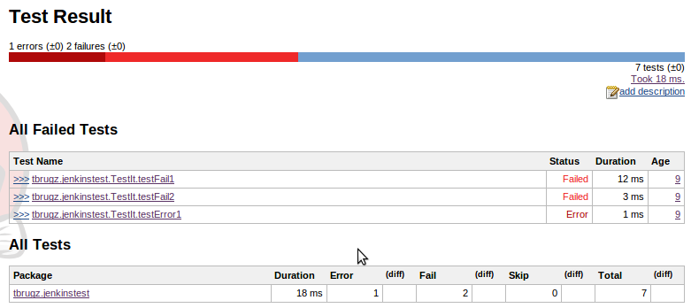
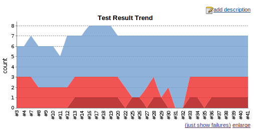

`Pytest` desde las trincheras
=============================

Pau Ruŀlan Ferragut

pau@rullan.cat + prullan@apsl.net

EuroPython 2016 - Bilbao 19/7/2016


Cómo usar pytest para cosas que no nos vienen a la cabeza al
usar un framework de testing.


Recreación de batallitas con Pytest


Trabajo en APSL como sysadmin

(lo que en _cool_ hoy en día llaman `SRE` o

_ingeniero de fiabilidad_)


En APSL siempre buscamos talento…


puedes venir a disfrutar de los infitos días de sol de Mallorca


Py.test como herramienta de QA o sysadmin y no como gestor de tests unitarios.


# Caso 0: estándares de estilo


Un truco para forzar a nuestros programadores a seguir un estilo de código es que EL PROPIO CÓDIGO sea un test.
Note:
https://pypi.python.org/pypi/pytest-flake8
https://github.com/carsongee/pytest-pylint


```
pip install pytest-flake8
```

```
# content of setup.cfg
[pytest]
flake8-max-line-length = 99
```


```
$ py.test -v --flake8
― FLAKE8-check ―
conftest.py:4:1: F401 'glob' imported but unused
conftest.py:10:1: E302 expected 2 blank lines, found 1
conftest.py:17:1: E302 expected 2 blank lines, found 1
conftest.py:20:5: E265 block comment should start with '# '
conftest.pyFLAKE8-check ⨯   3% ▍         

― FLAKE8-check ―
test_files.py:42:1: E302 expected 2 blank lines, found 1
test_files.py:90:1: E302 expected 2 blank lines, found 0
test_files.py:112:12: E127 continuation line…
test_files.pyFLAKE8-check ⨯
```


De esta manera eliminamos git.hooks y preprocesadores para convertir nuestras
reglas de estilo de código en tests.


Usaremos la salida XML del `jUnit` para guardar el estado.

```
py.test --junit-xml=path.xml
```


Así Jenkins _entiende_ que estamos pasando tests.
```
jenkins  JUnit Attachments Plugin
```






# Caso 1: mini scraper


Crearemos un pequeño script que arranque Selenium.


Con `assert` confirmaremos
si una variable es verdadero.

```python
assert req.ok
assert items > 3
```


Los *fixtures* `py.test` son mucho más flexibles y potentes que los típicos de xUnit.


Tienen nombres explícitos y basta usarlos como parámetros en las funciones para utilizarlos.

```python
def test_file(tmpdir):
    pass
```


Los fixtures se comportan como un _inyector de dependencias_ y son los propios tests que consumen el resultado.


Selenium es una maravilla y podemos

rápidamente integrarlo con `py.test`

```
pip install pytest-splinter
```


Explotaremos los fixtures que nos proporciona `splinter` para accedir al navegador
y hacer nuestro fixture de login


```python
# conftest.py
import pytest

@pytest.fixture
def login(browser):
    browser.visit('http://site-demo.apsl.net/')
    browser.fill('username', 'user')
    browser.fill('password', 'SUPERSECRET')
    browser.find_by_css('#submit').click()
```


```python
def test_add_item(browser, login):
    browser.fill('slug', 'test')
    browser.find_by_css('input#submit').click()
    assert browser.find_by_css('tr td')[0] == 't'

    with browser.get_iframe(0) as iframe:
        iframe.find_by_css('button').click()

    assert not browser.find_by_css('tr td')
```


Lo que si podemos hacer es usar `ipdb` cuando lo necesitemos:

```python
def test_add_item(browser, login):
    …
    import ipdb; ipdb.set_trace()
    …
```

```
py.test -s      #  shortcut for --capture=no.
```


# Caso 2: `mariano20`


A Mariano le encantaba hacer de nagios humano.


Lo robotizamos e hicimos el

«Mariano 2.0» o `mariano20`


En realidad es un scraping que lee de un fichero de configuración las páginas que tienen que existir.

También verifica algunas redirecciones.


```yaml
sites:
  ca:
    redirect: https://ca.wikipedia.org/wiki/Portada
    title: Viquipèdia
    today: mp-left

  de:
    redirect: https://de.wikipedia.org/wiki/Wikipedia:Hauptseite
    today: Artikel_des_Tages
    title: Wikipedia – Die freie Enzyklopädie
```


```
$ py.test -v mariano20.py
```


```python
import yaml
from collections import namedtuple
Site = namedtuple('Site',
                  'homepage redirect title today')
BASE_SITE = "https://{}.wikipedia.org"
def load_sites():
    with open("sites.yaml") as f:
        params = yaml.load(f)
    for code, data in params['sites'].items():
        data['homepage'] = BASE_SITE.format(code)
        yield Site(**data)
```


```python
import pytest
import requests
@pytest.mark.parametrize("site", load_sites())
def test_site_redirect(site):
    r = requests.head(site.homepage,
                      allow_redirects=True)
    assert r.ok
    assert len(r.history) == 1
    redirect, = r.history
    assert redirect.is_permanent_redirect
    assert r.url == site.redirect
```


```python
from bs4 import BeautifulSoup

@pytest.mark.parametrize("site", load_sites())
def test_home_today_article(site):
    r = requests.get(site.homepage)
    assert r.ok, "Could not load site"
    soup = BeautifulSoup(r.content, 'html.parser')
    assert site.title == soup.title.string
    assert soup.find(id=site.today)
```


```
$ py.test mariano20.py  -v
```


```
― test_home_today_article[de] ――
site = Site(title='Viquipèdia',
  today='Artikel_des_Tages',
  homepage='https://de.wikipedia.org',
  redirect='https://de.wikipedia.org/wiki/Wikipedia:Hauptseite')
  …
> assert site.title == soup.title.string
E assert 'Viquipèdia' == 'Wikipedia – Die freie Enzyklopädie'
E   - Viquipèdia
E   + Wikipedia – Die freie Enzyklopädie
mariano20.py:33: AssertionError
```


```
…
>assert site.title == soup.title.string
Eassert 'Viquipèdia' == \
        'Wikipedia – Die freie Enzyklopädie'
E  - Viquipèdia
E  + Wikipedia – Die freie Enzyklopädie
…
```


Podemos atacar directamente a los tests problemáticos:

```bash
py.test --exit-first
```

```bash
py.test --last-failed
```

```bash
py.test --failed-first
```


El parámetro `--lf` nos ejecutará solamente
los tests que fallaron.

```
$ py.test mariano20.py --lf
run-last-failure: rerun last 2 failures
 mariano20.py ✓✓        100% ██████████

Results (1.40s):
       2 passed
       6 deselected
 ```


Queremos probar el rendimiento de nuestro super nagios:

```
 $ time py.test mariano20.py
  mariano20.py ✓✓✓✓✓✓✓✓           100% ██████████

 Results (5.67s):
        8 passed

 real 0m6.085s
 user 0m1.348s
 sys  0m0.068s
 ```


Y lo ponemos en paralelo: `xdist`

```
pip install pytest-xdist
```

e indicamos el número de procesos a crear (o auto):

```
py.test -n auto
```
Note: https://pypi.python.org/pypi/pytest-xdist


```
$ time py.test mariano20.py  -n auto

 mariano20.py ✓✓✓✓✓✓✓✓      100% ██████████

Results (2.18s):
       8 passed

real 0m2.839s
user 0m4.208s
sys  0m0.316s
```


¿Queremos averiguar qué tests son los más lentos?

```
py.test --durations=8
```

```
== slowest 8 test durations ==
0.69s mariano20.py::test_home_today_article[it]
0.66s mariano20.py::test_home_today_article[ca]
0.66s mariano20.py::test_home_today_article[en]
0.61s mariano20.py::test_home_today_article[de]
0.49s mariano20.py::test_site_redirect[en]
0.47s mariano20.py::test_site_redirect[it]
0.45s mariano20.py::test_site_redirect[de]
0.45s mariano20.py::test_site_redirect[ca]

Results (2.10s): 8 passed
```


Algunas veces tenemos problemas de red; don't panic!

Tenemos `flaky` para los tests _poco fiables_.

```
pip install flaky
```
```python
from flaky import flaky
@flaky(max_runs=3, min_passes=2)
def test_with_network_problems(self):
    r = requests.get(homepage, timeout=0.5)
    assert r.ok
```

Note: https://github.com/box/flaky


# Caso 3: `filechecker`


Confirmar que un conjunto de ficheros sigue una nomenclatura de _código-numérico_nombre.extensión_

```
000_carga-verano-2016.sql
```


En lugar de hacer un script escribiremos tests con `py.test`.


El sistema de `assert` en `py.test` es muy _pythonico_

```python
self.assertEquals(x, y)
```

```python
assert x == y
```


Pero `py.test` sabe analizar los tipos primitivos de Python: compará
diccionarios, listas y tuplas.

```python
def test_eq_dict(self):
>       assert {'a': 0, 'b': 1, 'c': 0} == \
               {'a': 0, 'b': 2, 'd': 0}
E  Differing items:
E  {'b': 1} != {'b': 2}
E  Left contains more items:
E  {'c': 0}
E  Right contains more items:
E  {'d': 0}
```


Manipula excepciones y warnings:

```
def test_exceptions_and_warnings():
    with pytest.raises(AttributeError):
        raise AttributeError
    with pytest.warns(UserWarning):
        myobject.method_with_warnings()
    with pytest.deprecated_call():
        myobject.deprecated_method()
```


Podemos añadir un parámetro al `py.test` para indicar de qué directorio coger
los ficheros.

```python
# conftest.py
def pytest_addoption(parser):
  parser.addoption(
    "--chekfiles",
    default="./test-examples",
    help="set the dir to read the code"
  )
  ```

```
py.test --checkfiles=dir
```


Podemos integrar la recolección de ficheros con un parametrizador


```python
# conftest.py
def pytest_generate_tests(metafunc):
  checkfiles = metafunc.config.option.checkfiles
  matches = []
  for root, dirnames, fns in os.walk(checkfiles):
    for fn in fnmatch.filter(fns, '*'):
      matches.append(os.path.join(root, fn))
  metafunc.parametrize("check", matches)
```


Nuestra función de comprovación de extensión recibirá el parámetro `checkfile`

```python
def test_filenames_extensions(check):
  extension = path.splitext(check)[1].strip(".")
    assert extension in allowed_extensions, \
      "Extension %s not allowed" % (extension, )
```


Verificar que no contiene saltos de línia Mac también será un plis.

```python
def test_macos_eol(check):
    with open(check) as f:
        assert "\r" not in f.read()
```  


Finalmente podemos mirar que el fichero esté en `utf-8`.

Aquí empieza a brillar el hecho que usemos Python para probar
cosas: nada de usar `bash` y `file`.


Mejor usar magia.
```
pip install filemagic
```
```python
flags = magic.MAGIC_MIME_ENCODING
with magic.Magic(flags=flags) as m:
    try:
        encoding = m.id_filename(check)
    except magic.MagicError:
        assert False, "Could not decode file"
assert encoding == "utf-8"
```


Incorporamos en la misma batería de tests ejemplos y gestionamos los casos que SABEMOS que tienen que fallar con `xfail`.
Note: http://pytest.org/latest/skipping.html#skipping


`xfail`, como la mayoría de plugins o atributos de `py.test`, lo podemos indicar como decorador de la función o en el cuerpo.

```python
@pytest.mark.xfail("Won't work!", strict=True)
def f(x):
  pass
```


```python
def test_macos_eol(check):
  # fixture checking
  if path.basename(check) in MACOS_EOL_FAIL_LIST:
    pytest.xfail("Expected to fail: \r in file")
  with open(check) as f:
    assert "\r" not in f.read()
```


